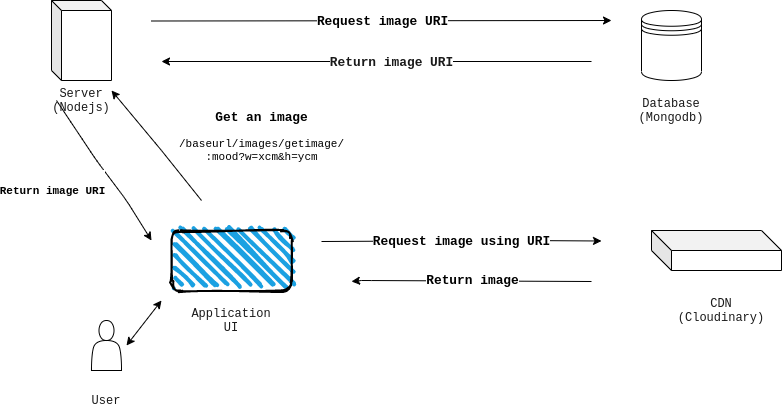
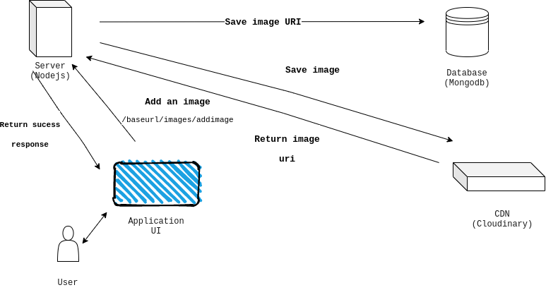

# Therapeutic Images Repository

> Get on-demand therapeutic images (a.k.a images based on moods). For therapist helping struggling clients get back to their normal lives.

So please select from the table of contents what part of the app to explore.

## Table of contents

- [General info](#general-info)
- [Technologies](#technologies)
- [Setup](#setup)
- [Examples](#examples)
- [Features](#features)
- [Architecture](#architecture)
- [Inspiration](#inspiration)
- [Contact](#contact)

## General info

So, what's your mood. We've got the picture.

## Technologies

- Node (Server)
- Express (Router)
- Cloudinary (CDN)

## Setup

This code requires the following prerequisites to build:

- [Node.js](https://nodejs.org/en/)
- [MongoDB](https://mongodb.org)
- A [Cloudinary](https://cloudinary.com) developer account

To run the code, follow these steps:

1. `git clone git@github.com:Peartes/imagerepo.git` will copy the code here to your machine
2. `cd app/` will go into the directory where the code is stored
3. `npm i` will install all required dependencies
4. `npm start` will start the server locally!

Before it works, you'll need to specify some parameters in the .env file.
Create a file `.env` with the following contents:

```
  MONGO_DB_URL=mongodb://127.0.0.1:27017
  PORT=8080
  imageDB=therapeuticimage
  cloudinaryCloudName=xxxxxx
  cloudinaryApiKey=xxxxxxxxxxxx
  cloudinaryApiSecret=xxxxxxxxxxxxx
```

Confirm that the application is running properly by running tests using

```
npm run test
```

and confirm that all tests are passing as below


## Examples

Okay, let's use the app shall we. First we make sure we have the application set up and running well. You can make sure of that by running tests as described above. In this tutorial, we would be using a hosted app, you could use this hosted app or run locally.

### **_First let's add an image to the repo_**

So, you have a therapeutic image and want to add to the repo, yay. Here are a few things to know:

- Make sure you know the mood of the image. Well, for now we only take "happy" :smiley:, "sad" :pensive:, "calm" :relieved: and "depressed" :worried: moods any other will be ignored.
- Also, allowed file types are jpg|JPG|jpeg|JPEG|png|PNG|gif|GIF. Any other would be rejected sorry :cry:

Once we have confirmed that the requirements are met, and the app is running, let's add an image to the repo.

**NOTE: I have an image in the test folder and i would be using that but as for you you'll replace the image path with yours.**

You can use anything to call the endpoint, i am using curl in this tutorial. Run this command

```
curl
```

### **_Now let's get an image from the repo_**

Getting an image is pretty easy. Let's get one. **Hold up** :hand:. Let's see the structure of our get request

```
curl https://therapeuticimages.herokuapp.com/images/getimages/:mood?w=xcm&h=ycm
```

- _The request takes a parameter mood which is the mood of the image you want to get and_
- _two **optional** query strings, width and height to specify the height and width of the image._

Making a request for an happy image is as follow

```
curl https://therapeuticimages.herokuapp.com/images/getimages/happy
```

gives the response

```JSON
{
  "error":false,
  "code":200,
  "data":{
    "status":200,
    "image":[
      {
        "_id":"5fff231fff32fd698a317021",
        "tags":["happy","sad"],
        "imageUri":"https://res.cloudinary.com/
                    dwhrr1qfw/image/upload/v1610556191/
                    shopify/happy/s3ml2kdlwh
                    cubc2k8r1d.png",
        "createdAt":"2021-01-13T16:43:11.685Z",
        "updatedAt":"2021-01-13T16:43:11.685Z",
        "__v":0
      }
    ]
  },
  "message":"Gotten an image matching your mood"
}
```

The property of the response are:

- error : True for succesfull request and false otherwise
- code: The status code of the request 200 for successfull, any other code signifies failure
- data : The response object
  - status : similar to code
  - image : The image you requested for (your happy image)
    - tags : This are the moods the image could represent. They are also yardsticks to confirm that the image you receive is indeed for your mood
    - imageUri : This is the image resource identifier, use this to view your image. Copy and paste it into a browser.
- message : This property gives a brief description on the status of the request

Every other property are metadata and can be ignored.
For any size of the image, add the query strings _w_(width in cm) and _h_(height in cm). The response is the same.

## Features

- Add an image to the repo
  - route : /baseurl/images/addimage
- Get an image from the repo
  - route : /baseurl/images/getimage/:mood?w=xcm&h=ycm

## Architecture

The app has 2 main feature as descibed in above. Below is a diagramatic top-level view of the app architecture

### **APP ARCHITECTURAL DIAGRAM**



It is pretty simple -

- The user needs an image and communicates that to the user application (browser, another app or any ui software).
- The application then requests for an image from the server using the endpoint shown in the diagram
- The server communicates with the database to get an image uri that matches your mood (the one you passed)
- The database returns one randomly selected image
- The server respond to the application returning the uri of the image
- Then the application uses the uri to request the image from cloudinary
- Cloudinary returns the image matching the uri
- The application then displays the image to the needing user

The architecture uses the _get and image_ feature to explain the flow. The architecture is similar with the same components (although now they are acting differently) when adding an image as described below.



Here we want to add an image

- The user needs to add an image and communicates that to the user application (another app or any software).
- The application then sends the imaeg to the server with the moods tag of the image
- The server saves the image in cloudinary
- Cloudinary then returns a uri for the image
- The server saves the uri in the database and
- Returns a success message to the user application

## Inspiration

2020 dealt a blow to the way we live no doubt and during that time we had a surge in people struggling with their mental health. Our therapist are put to the work to help those struggling get back to normalcy and one of the way they do it is using images. So, we created an image repo to provide this therapeutic images to therapist based on the mood and even better, the images can come in any size you want.

## Contact

Created by [@peartes](https://github.com/peartes) - feel free to contact me!
