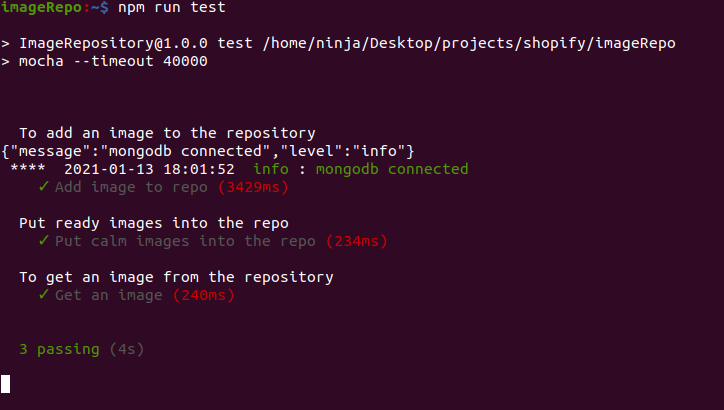

# Therapeutic Images Repository

> It is simple. We provide on-demand therapeutic images (a.k.a images based on moods) for therapist helping struggling clients get back to their normal lives.

So please select from the table of contents what part of the app to explore.

## Table of contents

- [General info](#general-info)
- [Technologies](#technologies)
- [Setup](#setup)
- [Examples](#examples)
- [Features](#features)
- [Architecture](#architecture)
- [Inspiration](#inspiration)
- [Contact](#contact)

## General info

So, what's your mood. We've got the picture.

## Technologies

- Node (Server)
- Express (Router)
- Cloudinary (CDN)

## Setup

This code requires the following prerequisites to build:

- [Node.js](https://nodejs.org/en/)
- [MongoDB](https://mongodb.org)
- A [Cloudinary](https://cloudinary.com) developer account

To run the code, follow these steps:

1. `git clone git@github.com:Peartes/imagerepo.git` will copy the code here to your machine
2. `cd app/` will go into the directory where the code is stored
3. `npm i` will install all required dependencies
4. `npm start` will start the server locally!

Before it works, you'll need to specify some parameters in the .env file.
Create a file `.env` with the following contents:

```
  MONGO_DB_URL=mongodb://127.0.0.1:27017
  PORT=8080
  imageDB=therapeuticimage
  cloudinaryCloudName=xxxxxx
  cloudinaryApiKey=xxxxxxxxxxxx
  cloudinaryApiSecret=xxxxxxxxxxxxx
```

Confirm that the application is running properly by running tests using

```
npm run test
```

and confirm that all tests are passing as below


## Examples

Okay, let's use the app shall we. First we make sure we have the application set up and running well. You can make sure of that by running tests as described above.

### **_First let's add an image to the repo_**

So, you have a therapeutic image and want to add to the repo, yay. Here are a few things to know:

- Make sure you know the mood of the image. Well, for now we only take "happy" :smiley:, "sad" :pensive:, "calm" :relieved: and "depressed" :worried: moods any other will be ignored.
- Also, allowed file types are jpg|JPG|jpeg|JPEG|png|PNG|gif|GIF. Any other would be rejected sorry :cry:

Once we have confirmed that the requirements are met, and the app is running, let's add an image to the repo.

**NOTE: I have an image in the test folder and i would be using that but as for you you'll replace the image path with yours.**

You can use anything to call the endpoint, i am using curl in this tutorial. Run this command

```
curl
```

## Features

- Add an image to the repo
  - route : /baseurl/images/addimage
- Get an image from the repo
  - route : /baseurl/images/getimage/:mood?w=xcm&h=ycm

## Inspiration

2020 dealt a blow to the way we live no doubt and during that time we had a surge in people struggling with their mental health. Our therapist are put to the work to help those struggling get back to normalcy and one of the way they do it is using images. So, we created an image repo to provide this therapeutic images to therapist based on the mood and even better, the images can come in any size you want.

## Contact

Created by [@peartes](https://github.com/peartes) - feel free to contact me!
